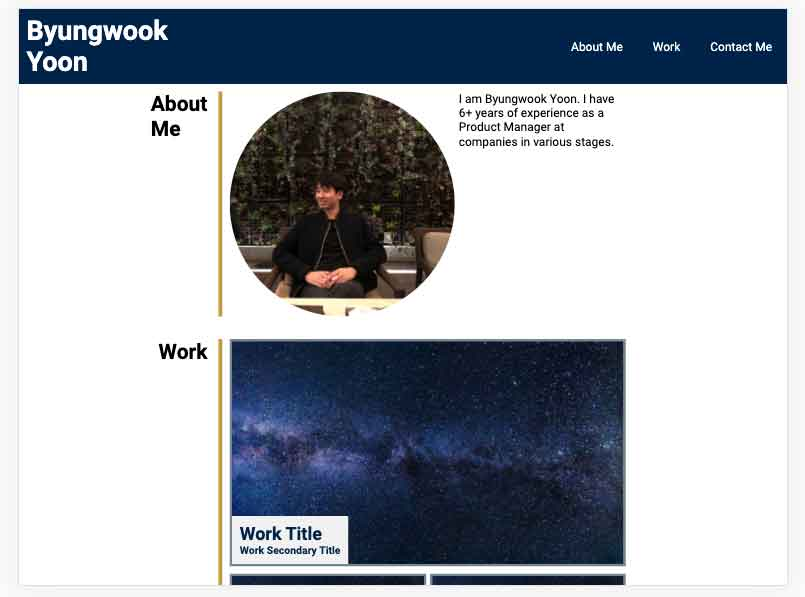

# Columbia University Bootcamp Week 2 Homework: Porfolio

## Introduction
This repo is my second homework for my Columbia Bootcamp. I completed the following:
1. I created my porfolio template from scratch.
2. I used flexbox to structure my page.
3. I used media queries to make my page responsive.
4. I used CSS to add a bit of color to my page as well.

Screenshot:

## Technology
* HTML
* CSS

## Link to Deloyed Site
https://byung90.github.io/columbia-week2-homework/

## License
[MIT](https://choosealicense.com/licenses/mit/)